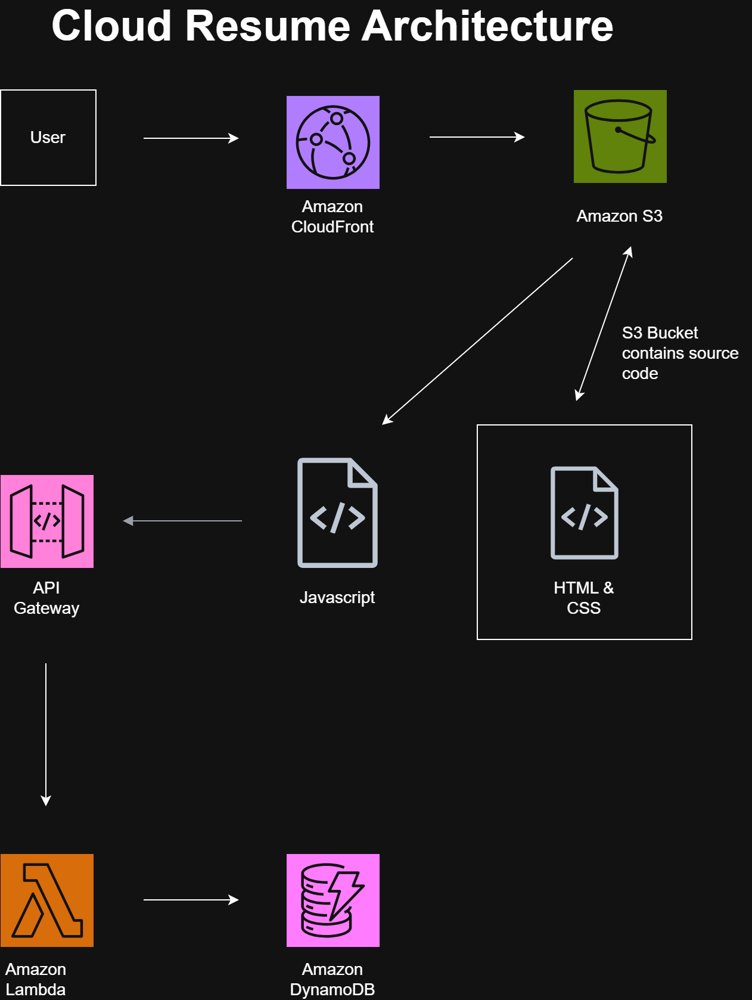

# My Cloud Resume

A serverless resume website hosted on AWS with a visitor counter.

## 🚀 Live Demo
[View the live site](https://d18vqdtvxz69ps.cloudfront.net/)

## 📋 Overview
This project is a personal resume website built using a serverless architecture on AWS. It features a static frontend hosted on S3 with a CloudFront CDN for global delivery, and a serverless visitor counter powered by Lambda, API Gateway, and DynamoDB.

## 🏗️ Architecture

The architecture consists of:
- **S3**: Hosts the static HTML/CSS/JS files
- **CloudFront**: Serves the content globally with HTTPS and caching
- **API Gateway**: Provides an HTTP endpoint for the visitor counter
- **Lambda**: Handles the business logic to increment and retrieve the visitor count
- **DynamoDB**: Stores the visitor count persistently

## 🛠️ Technologies Used
- AWS S3 (static hosting)
- AWS CloudFront (CDN)
- AWS API Gateway (HTTP API)
- AWS Lambda (serverless compute)
- AWS DynamoDB (NoSQL database)
- HTML/CSS/JavaScript
- Git & GitHub

## 📊 Key Features
- **Global Performance**: Content delivered via CloudFront's edge locations
- **Serverless Backend**: No servers to manage; automatically scales
- **Secure by Design**: S3 bucket remains private; CloudFront handles public access
- **Real-time Visitor Counter**: Updates instantly on page load

## 🔧 How to Deploy This Yourself

### Prerequisites
- AWS Account (Free Tier eligible)
- AWS CLI installed and configured
- Your own `Resume.html` file

### Deployment Steps
1. **S3 Bucket**: Create an S3 bucket and upload your static files
2. **CloudFront**: Create a CloudFront distribution pointing to your S3 bucket
3. **DynamoDB**: Create a `VisitorCount` table with partition key `ID`
4. **Lambda**: Create a function with the code from this repo
5. **API Gateway**: Create an HTTP API with a GET route to `/visitor`
6. **Connect**: Add the API URL to your JavaScript

## 🗺️ Future Improvements
- [✓] Add CI/CD pipeline with GitHub Actions (Already done)
- [ ] Use Infrastructure as Code (Terraform)
- [ ] Add authentication for admin features
- [ ] Implement graceful error handling

## 📄 License
This project is open source and available under the MIT License.

## 📬 Contact
- Email: ogunkoyaoluwatomisin775@gmail.com
- LinkedIn: linkedin.com/in/Oluwatomisin Ogunkoya
- GitHub: github.com/meliora775
